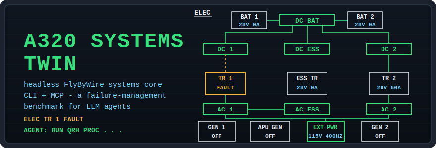
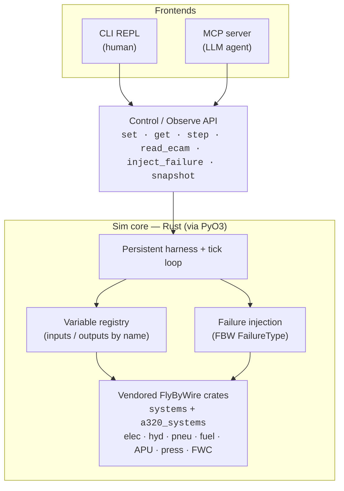
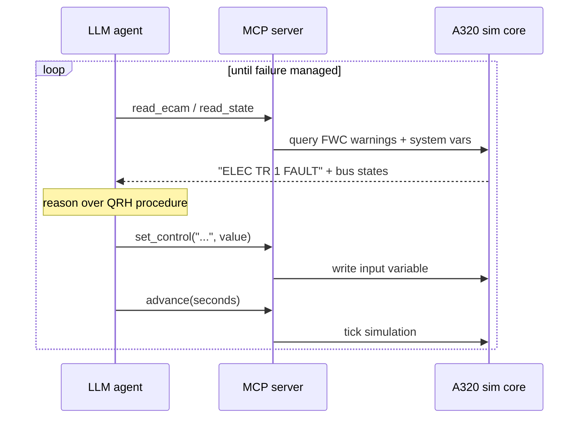

<div align="center">



**A headless digital twin of the A320's aircraft systems — no MSFS, no X-Plane — built on
[FlyByWire](https://github.com/flybywiresim/aircraft)'s open-source systems code, operable
from a terminal by a human or over MCP by an LLM agent.**

[](#license--credits)
[](core-rs/rust-toolchain.toml)
[](docs/decisiones.md)
[](#roadmap)
[](#the-agent-loop)

</div>

---

## What is this

The real interaction between an A320's systems — electrical, hydraulic, pneumatic, fuel, APU,
pressurization, and the FWC that raises ECAM warnings — lives in FlyByWire's Rust crates and
does **not** need a flight simulator at runtime. This project compiles those crates natively,
wraps them in a persistent tick loop, and exposes one control/observe API through two frontends:

- a **CLI** for a human to operate the aircraft from the terminal — flip switches, read buses,
  advance time, inject failures;
- an **MCP server** for an LLM to fly the closed loop: observe (ECAM + state), reason (QRH),
  act, advance, observe again.

The end goal is a reproducible environment for **failure detection and management following
real procedures (ECAM/QRH)**, designed as an **LLM-agent benchmark**. The research contribution
is not the aircraft model (that is FlyByWire's) — it is the evaluable environment, the failure
scenario suite, and the procedure-compliance scoring.

## Demo

Real output of the current spike (`core-rs/src/main.rs`): cold & dark on the apron, batteries
on, external power on, then a **transformer-rectifier failure injected** — the network
reconfigures through the bus tie exactly like the real aircraft, while TR 1 itself drops out:

```text
$ cargo run
[cold & dark]    AC_1=false DC_1=false DC_BAT=false DC_HOT_1=true  TR_1_OK=false
[baterias ON]    AC_1=false DC_1=false DC_BAT=true  DC_HOT_1=true  TR_1_OK=false
[ext pwr ON]     AC_1=true  DC_1=true  DC_BAT=true  DC_HOT_1=true  TR_1_OK=true
[fail TR 1]      AC_1=true  DC_1=true  DC_BAT=true  DC_HOT_1=true  TR_1_OK=false
```

No simulator running. The whole aircraft systems stack is ticking inside one native process.

## Architecture

One core, two frontends: the CLI and the MCP server are two windows onto the same
control/observe API.



The systems logic is reused untouched from FlyByWire; this repo builds everything around it —
the analogy is that FBW provides the **engine block**, and this project builds the chassis
(headless harness), the dashboard (CLI/MCP) and wires the ignition (`UpdateContext` + variable
registry).

| | |
|---|---|
| **Reused from FlyByWire** | All systems logic: hydraulic pressurization, electrical bus feeding, APU start sequence, FWC warning logic, failure models |
| **Built here** | Native standalone build, persistent tick loop, variable registry, world-boundary inputs (`UpdateContext`), control/observe API, CLI, MCP server, scenario suite + scoring |

## The agent loop



MCP tools exposed to the agent: `set_control`, `read_state`, `read_ecam`, `advance`,
`inject_failure`, `list_failures`, `clear_failure`, `snapshot`, `list_controls`.

## Quickstart

1. **Install Rust** (if you don't have it):

   ```powershell
   winget install Rustlang.Rustup
   ```

   On Windows, rustup uses the MSVC target: if the **Visual Studio Build Tools (C++)** are
   missing, rustup itself will tell you during install
   (`winget install Microsoft.VisualStudio.2022.BuildTools`). The exact toolchain (Rust 1.93.0)
   auto-installs on first build thanks to `rust-toolchain.toml`.

2. **Vendor FlyByWire** (pinned submodule, efficient blob-filtered + sparse clone):

   ```powershell
   .\scripts\bootstrap-vendor.ps1
   ```

3. **Build and run the spike**:

   ```powershell
   cd core-rs
   cargo run
   ```

   The first build takes several minutes (it compiles the FBW monorepo's dependencies).

4. **(Optional) Python bindings** — drive the same core from Python. Building now needs
   **both** toolchains (Rust + Python ≥ 3.9), since it compiles the Rust core into a Python
   extension:

   ```powershell
   cd bindings
   python -m venv .venv
   .\.venv\Scripts\Activate.ps1
   pip install -e .
   python tests\test_smoke.py
   ```

   Then `import a320_sim` exposes the `Sim` class (see [bindings/README.md](bindings/README.md)).

5. **(Optional) CLI** — operate the aircraft from a terminal. After the bindings
   are installed in the same environment:

   ```powershell
   pip install -e cli/
   a320-cli            # or: python -m a320_cli
   ```

## Operate it from the terminal (CLI)

The CLI is the human window onto the core: flip switches, read buses, advance
time, and `watch` the electrical network come alive. Commands map 1:1 onto the
API (`set` / `get` / `step` / `run` / `env` / `snapshot` / `controls` / `vars` /
`watch`); control names tab-complete from the curated catalog, and errors print a
one-line message instead of a traceback. Full command reference in
[cli/README.md](cli/README.md).

**Worked example — the Phase-1 target scenario** (cold & dark → battery →
external power), typed straight into the REPL:

```text
a320 [t=   1.0s]> set bat_1 on
  bat_1 <- 1
a320 [t=   1.0s]> set bat_2 on
  bat_2 <- 1
a320 [t=   1.0s]> watch ELEC_DC_BAT_BUS_IS_POWERED ELEC_AC_1_BUS_IS_POWERED
watching 2 var(s) at 5 Hz - Ctrl+C to stop
* ELEC_DC_BAT_BUS_IS_POWERED   1     <- DC BAT bus comes alive around t=2.0s
  ELEC_AC_1_BUS_IS_POWERED     0        (AC stays dead: no AC source yet)
  t=    2.00s
^C
  [watch stopped at t=3.20s]

a320 [t=   3.2s]> set bus_tie auto     # AUTO is mandatory: no seeding (D-007)
  bus_tie <- 1
a320 [t=   3.2s]> set ext_pwr_avail 1
  ext_pwr_avail <- 1
a320 [t=   3.2s]> set ext_pwr on
  ext_pwr <- 1
a320 [t=   3.2s]> watch ELEC_AC_1_BUS_IS_POWERED ELEC_AC_2_BUS_IS_POWERED ELEC_DC_1_BUS_IS_POWERED ELEC_DC_2_BUS_IS_POWERED
watching 4 var(s) at 5 Hz - Ctrl+C to stop
* ELEC_AC_1_BUS_IS_POWERED     1     <- whole AC network wakes up around t=3.6s
* ELEC_AC_2_BUS_IS_POWERED     1
* ELEC_DC_1_BUS_IS_POWERED     1
* ELEC_DC_2_BUS_IS_POWERED     1
  t=    3.60s
```

The `*` marks a powered bus. `watch` advances the sim at ~5 Hz and re-renders in
place, so you see contactors sequence — not just a before and an after.

## Roadmap

| Phase | Scope | Status |
|---|---|---|
| **0 — Feasibility spike** | Compile FBW's `systems` + `a320_systems` natively, instantiate the A320, tick it, read electrical vars, inject a failure | **Done** — success criterion met (see [Demo](#demo)); zero patches to vendored code needed; 102 upstream electrical tests pass natively; stack settled ([D-004](docs/decisiones.md)) |
| **1 — Core + API + CLI** | Persistent runtime over `Simulation<A320>`, variable registry, `set`/`get`/`step` API, human REPL; electrical vertical slice on ground | **In progress** — design note in [docs/fase1-runtime.md](docs/fase1-runtime.md) (Spanish) |
| **2 — Failures + detection** | `inject_failure` / `list_failures`, `read_ecam` mapping FWC warnings | Planned |
| **3 — MCP server** | Expose the API as MCP tools; end-to-end demo: hand an LLM a failed generator and watch it work the procedure | Planned |
| **4 — More systems** | Hydraulics, APU, fuel, engine start; richer world boundary (N2 input) | Planned |
| **5 — Benchmark (research)** | Scenario suite with QRH ground truth, trajectory-level compliance scoring, baselines + ablations | Planned |

Architecture decisions are recorded in [docs/decisiones.md](docs/decisiones.md) (Spanish):
FBW pin, why no msfs-rs decoupling was needed, PyO3 vs pure-Rust rationale. Project
conventions live in [CLAUDE.md](CLAUDE.md) (Spanish).

## Repo layout

```text
core-rs/        Rust core: harness + API + vendored FBW (pinned git submodule)
  vendor/       flybywiresim/aircraft @ 13bce4b (GPLv3)
bindings/       PyO3 bindings                 (Phase 1)
cli/            Python REPL                   (Phase 1)
mcp/            MCP server                    (Phase 3)
scenarios/      Failure scenarios + QRH ground truth (Phase 5)
docs/           Design notes + decision log
scripts/        bootstrap-vendor.ps1
```

## License & credits

**GPLv3**, inherited from the [FlyByWire Simulations](https://github.com/flybywiresim/aircraft)
crates this project vendors and links against. All aircraft systems modeling credit goes to the
FlyByWire team — this project would not exist without their decision to write the A320's systems
in simulator-agnostic Rust.

The vendored FBW tree is **pinned to a specific commit** (`13bce4b`, see
[docs/decisiones.md](docs/decisiones.md)): benchmark reproducibility depends on it, so the pin
only moves with a recorded decision.
